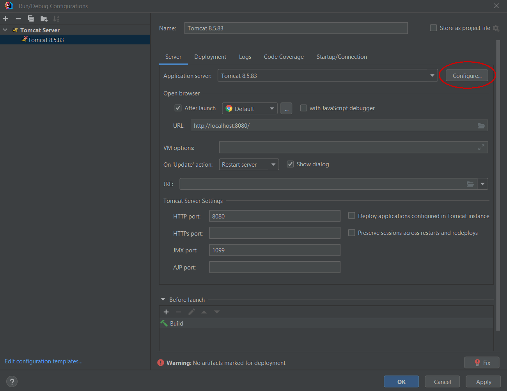

# CINEMA API 🍿
## ✒ Description
Cinema is an application that will allow you to easily book cinema tickets to view the latest releases from around the world. This project is built on the basis of N-tier architecture and principles of OOP and SOLID. The application supports all CRUD operations. Security solution will make sure that all your data is confidential.
## 🛠️ How to Install and Run the Project
1. Install JDK v11 or later
2. Clone this project to your JDK
3. Install MySQLWorkbench v8.0 or later
4. Configure [db.properties](src/main/resources/db.properties) file
5. Install Apache Tomcat v8.5.83 or later
6. [Configure Apache Tomcat in JDK](#configure-apache-tomcat)
7. Click on debug on the toolbar to use the application
## 👩‍💻 Technologies
Application based on Spring Framework v5.2.2.RELEASE
### **Web**
* Apache Tomcat v8.5.83 as servlet
* Javax Servlet API v4.0.1
* Spring MVC
### **Security**
* Spring Security for manage authorization and authentication
### **Database**
* MySql Database v8.0.22
* JDBS driver for MySQL connector
### **Enviroments**
* MySqlWorkbench enviroment v8.0 CE
* IntelliJ IDEA
### **Others**
* Apache Maven as application builder
* Hibernate ORM v5.4.27.Final
* Apache commons v2.8.0
## 🍩 Features
This app provides you with a lot of useful functionality. If you are a registered and authenticated user, you can:
* view all cinema halls / movies / available movie sessions / own history orders / your shopping cart
* make orders

If you are a registered and authenticated admin, you can:
* view all cinema halls / movies / available movie sessions
* find user by mail
* add new cinema halls / movies / movie sessions
* change or delete movie session

Anyone who wants to use the application can register.

Test credentials for this application you can get from section below.
## 🗝️ Credentials
**For user role:**

login: user@gmail.com 

password: user123

**For admin role:**

login: admin@gmail.com

password: admin123
## 📑 Project structure
The project is based on the N-tier architecture, which also follows the principles of SOLID, which provides:
* presentation layer
* service layer
* DAO layer
* Database
### **Structure of cinema app database**

## Configure Apache Tomcat
1. On the toolbar, select Current File -> Edit Configurations

2. Add Apache Tomcat - Local
3. Click on Configure and choose the path to installed Apache Tomcat

4. Click on Fix

Select **project-name:war-exploded**

5. Delete text from Application context

Just leave it empty

6. Click OK